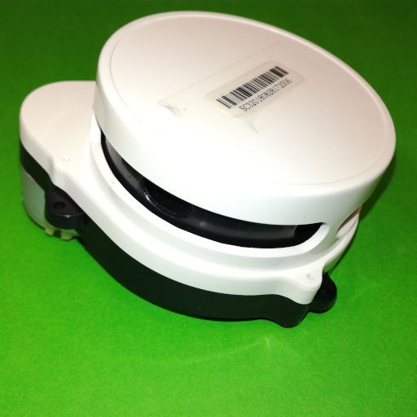

# Delta-2G LiDAR Driver
This is a device driver library for the Delta-2G LiDAR, a cheap LiDAR that can be found on AliExpress as a recovered product but without much information, no datasheet or interface protocol. The LiDAR uses a serial/UART interface to output messages. This specific LiDAR only has a data output (TX) line, no data input (RX) line so no settings can be changed. To connect to a PC a USB<->UART (FTDI) adapter is required.

The device driver was developed by reverse engineering the LiDARs interface protocol and by analyzing the datasheet of similar LiDARs that use the same style of interface protocol, namely the Delta-XX LiDAR series from 3irobotics, obtained after a fellow hobbyist brought them to my attention.

More information about the interface protocol, the workings of the Delta-2G LiDAR with a teardown as well as some test results can be found on my [website](notblackmagic.com/bitsnpieces/lidar-modules/). Also, for updates on this device driver and other projects of mine, follow me on [Twitter](https://twitter.com/NotBlackMagic1).



# File Organization

**Documents:** Machine translated (Google Translator) LiDAR protocol specification from 3irobotics.

**Software/Delta2GLiDAR.cs:** Simple C# Script to receive and translate the LiDAR modules messages.

**Software/LiDARConnection.py:** Simple Python Script to receive and translate the LiDAR modules messages.

**Software/ros2_ws:** ROS2 driver for the LiDAR module, as a colon workspace.

# Getting Started

## C# Driver
The C# driver works, without modifications, under Windows only. To use it create a new LiDARConnection object and call the **bool Connect(string port, int baudrate, Action<double[], double[], int> scanCallback, Action<int> rpmCallback)** function:

```cs
LiDARConnection liDARConnection = new LiDARConnection();
if (liDARConnection.Connect(comPort, comBaudrate, OnNewLaserScan, OnNewRPM) == true) {
	Debug.Log("LiDAR Connected");
}
```

The **Connect** function takes 4 arguments: 
- The port name, e.g. "COM3"
- The baudrate, for the Delta-2G it should be set to 115200. 
- A callback function for when a full scan is obtained, with the following structure: **void OnNewLaserScan(double[] ranges, double[] signalQuality, int size)**, with the ranges returned in meters.
- A callback function for when a new rotation speed message is received, with the following structure: **void OnNewRPM(int rpm)**

## Python Driver
The python driver works both under Windows and Linux. In contrast to the C# library, there is no need to create and call a new object, the script is simpler, and there are no callbacks for neither full scan received or rpm message received, instead only a message is printed to the terminal. Code can easily be added to do further processing/use of the received data. The driver requires the [pyserial](https://pypi.org/project/pyserial/) library. 

The serial port is selected with the **SERIAL_PORT** variable and differs between Linux and Windows. Under Windows it should be set to **COM3**, the actual COM port number may differ, while under Linux it should be set to **/dev/ttyUSB0**, again the actual USB number may differ. To get the available serial ports we can use a **pyserial** command: 

```py
python3 -m serial.tools.list_ports
```

Under Linux it can happen that the access to the serial port is denied, the simplest and fastest solution for that is to run the following command:

```
sudo chmod 666 /dev/ttyUSB0 
```

But this solution is only temporary, it is lost after a reset. There are more permanent solutions that can be found that I have not tried yet.

## ROS2 Driver
A simple ROS2 LaserScan publisher was written based on the Python driver and was tested under Linux. As is the case with the Python Driver, the **pyserial** library is required and the serial port name must be specified in the **ros2_ws/src/delta2g/delta2g/LiDARConnectionROS.py** file.

The driver publishes a fully filled LaserScan topic whenever a full scan (360 degrees) is received, including the signal quality information. The frame ID for the published LaserScan topic is **delta2g** but this can easily be changed in the **LiDARConnectionROS.py** file.

To run the driver, first build the workspace using colcon:

```bash
colcon build --packages-select delta2g
```

Followed by setting up the workspace and running the talker node:
```bash
. install/setup.bash
ros2 run delta2g talker
```

For faster testing, a configuration file for RVIZ is also included in the root folder, which can be used to configure RVIZ from the launch command:

```bash
rviz2 -d Delta2G.rviz
```

More details on simple Python publisher and subscriber nodes in ROS2 can be found [here](https://docs.ros.org/en/foxy/Tutorials/Beginner-Client-Libraries/Writing-A-Simple-Py-Publisher-And-Subscriber.html).